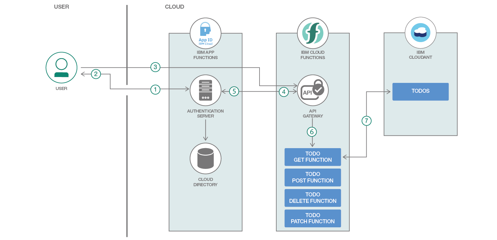

# Serverless REST API with IBM Cloud Functions (powered by Apache OpenWhisk)

[](https://travis.ibm.com/Andrea-Frittoli/ibm-cloud-functions-rest-api)

[](https://bluemix.net/deploy?repository=https://github.com/jthomas/ibm-cloud-functions-rest-api)

This reference architecture shows how serverless, event-driven architectures can execute code that scales automatically in response to demand from a REST API. No code runs until an API call to an endpoint associated to a function is received by the API GW. When that happens, application instances are started to match the load needed by each API request exactly.

In addition to using cloud resources efficiently, this means that developers can build and deploy applications more quickly. You can learn more about the benefits of building a serverless architecture for this use case in the accompanying [IBM Code Pattern](https://developer.ibm.com/code/technologies/serverless/).

The code in this repository implements a serverless REST API with IBM Cloud Functions. The REST API is a fully compliant implementation of the [TODO Backend API](https://www.todobackend.com/).

You can deploy it right away using the [provided deploy script on your own system](#deploy-through-the-deployment-script).

If you haven't already, sign up for an IBM Cloud account and go to the [Cloud Functions dashboard](https://console.bluemix.net/openwhisk/) to explore other [reference architecture templates](https://github.com/topics/ibm-cloud-functions-refarch) and download command line tools, if needed.

## Included components

* [IBM Cloud Functions](https://console.ng.bluemix.net/openwhisk) (powered by Apache OpenWhisk): Execute code on demand in a highly scalable, serverless environment.
* [IBM Cloud Functions APIs](https://console.bluemix.net/openwhisk/apimanagement) (powered by Apache OpenWhisk): Define APIs that wrap a set of OpenWhisk actions.
* [IBM Cloudant](https://console.ng.bluemix.net/catalog/services/cloudant-nosql-db): A fully managed data layer designed for modern web and mobile applications that leverages a flexible JSON schema (powered by CouchDB).
* [IBM AppID](https://console.bluemix.net/catalog/services/appid): Easily add authentication, secure back ends and APIs, and manage user-specific data for your mobile and web apps.

## TODO REST API with authentication

This application is a fully compliant implementation of the [TODO Backend API](https://www.todobackend.com/), with added authentication support.

It demonstrates using IBM Cloud Functions (based on Apache OpenWhisk) to build a REST API. The use case demonstrates how actions work with data services and execute logic in response to API requests. It also demonstrates how to secure the content behind the API using IBM AppID, by requiring an authentication token to access the API.

The authentication is terminated by the API Gateway, so functions do not need to worry about it. Functions receive the JWS token information from the API Gateway and can use it to add content authorisation rules. In this pattern authenticated users are connected to a dedicated Cloudant DB, so that the TODO list is personal
and persisted across sessions.



1. The user obtains a token from IBM AppID Auth Server. AppID verifies the user credentials against the Cloud Directory. AppID may also be configured to use different [authentication providers](https://console.bluemix.net/docs/services/appid/manageidp.html#managing).
2. IBM AppID Auth Server returns a JWS token to the user.
3. The user issues an API request (HTTP GET) to the IBM Cloud Functions API Gateway to access the protected resource, including the JWS token.
4. The IBM Cloud Functions API Gateway validates the token through IBM AppID.
5. IBM AppID validates the token.
6. The IBM Cloud Functions API Gateway invokes the function `todo_get` associated to the API endpoint and HTTP method.
7. The function uses the JWS token to learn about the user requesting the resource and to select the content in the IBM Cloudant NoSQL Database that the user is authorized to access. The function also builds the HTTP response and its JSON body with the requested 'TODO'.

## Featured technologies

* [Serverless](https://www.ibm.com/cloud-computing/bluemix/openwhisk): An event-action platform that allows you to execute code in response to an event.
* [Node.js](https://nodejs.org/): An open-source JavaScript run-time environment for executing server-side JavaScript code.

## Prerequisites

### Code and tools

You will need a few tools installed to deploy the pattern yourself:
* `git`
* `cURL`
* `ibmcloud` ([installation instructions](https://console.bluemix.net/docs/cli/reference/ibmcloud/download_cli.html#install_use)).
* [wskdeploy](https://github.com/apache/incubator-openwhisk-wskdeploy#downloading-released-binaries): required to deploy actions and APIs to IBM Cloud Functions
* [terraform](https://www.terraform.io/downloads.html) and [terraform IBM cloud](https://github.com/IBM-Cloud/terraform-provider-ibm/releases): required when installing using the [provided deploy script](#deploy-through-the-deployment-script)

Download the code using git:

```
git clone https://github.ibm.com/Andrea-Frittoli/ibm-cloud-functions-rest-api
cd ibm-cloud-functions-rest-api
```

### Deployment Alternatives

This pattern may be deployed without authentication. When authentication is disabled, the API can be consumed via the [client webapp](https://www.todobackend.com/client/index.html) and verified with the [API tests](https://www.todobackend.com/specs/index.html).

To disable authentication edit your `local.env` and set:

```
API_USE_APPID=false
```

### Account and credentials

1. You will need an IBM Cloud account to use this pattern. If you don't have one, [sign up for an IBM Cloud account](https://console.bluemix.net/registration/).

2. IBM Cloud Functions require an `org` and a `space` to be defined for your account. If you don't have them defined already you can follow the [instructions](https://console.bluemix.net/docs/account/orgs_spaces.html#orgsspacesusers) to create them. Alternatively you can use the `ibmcloud` CLI:

```
ibmcloud account org-create ORG_NAME
ibmcloud account space-create SPACE_NAME -o ORG_NAME
```

3. IBM Cloud Functions is available in different regions around the world. Select one region geographically close to you, and mark the `Name` from the table below.

```
Name       Display name    Customer   Deployment   Type
us-south   Dallas          IBM        Production   public
eu-de      Frankfurt       IBM        Production   public
eu-gb      London          IBM        Production   public
us-east    Washington DC   IBM        Production   public
```

4. You need an API key. You can create one via the [IBM Cloud user interface](https://console.bluemix.net/iam/#/apikeys) or via the `ibmcloud` CLI:

```
ibmcloud iam api-key-create serverless_api \
  -d "For Serverless API Pattern" \
  --file serverless_api.apikey
```

The key will be stored in `serverless_api.apikey`:

```
cat serverless_api.apikey
{
	"name": "serverless_api",
	"description": "For Serverless API Pattern",
	"apikey": "xxxx_myawsomeapikey_yyyy",
	"createdAt": "1970-01-01T01:01+0000",
	"locked": false,
	"uuid": "ApiKey-111111-aaaa-3333-bbbb-5555555555"
}
```

You are now ready to setup your `local.env` file. Make a copy of the `template.local.env` which is in the root directory of the git repo you cloned.
Edit `local.env` and set `IBMCLOUD_API_KEY`, `IBMCLOUD_ORG`, `IBMCLOUD_SPACE` and `BLUEMIX_REGION` to match the apikey in `serverless_api.apikey` and the org, space and region name that you're using.

```
# Prepare a local.env
cd ibm-cloud-functions-rest-api
cp template.local.env local.env

# In your favourite editor, set:
IBMCLOUD_API_KEY=xxxx_myawsomeapikey_yyyy
IBMCLOUD_ORG=ORG_NAME
IBMCLOUD_SPACE=ORG_SPACE
BLUEMIX_REGION=REGION
```

### Additional infrastructure

This pattern requires an instance of the [IBM Cloudant](https://console.ng.bluemix.net/catalog/services/cloudant-nosql-db) service and (optionally) of the [IBM AppID](https://console.bluemix.net/catalog/services/appid) service.
Both services are available in the [IBM Cloud catalog](https://console.bluemix.net/catalog/) and can be accessed using the IBM Cloud account previously created.

Both services offer a free service plan, named "lite", which is perfect for deploying and learning about this code pattern.

These two services are installed automatically via Terraform as part of the deployment process.
Only one instance per account of IBM Cloudant and IBM AppID may use the "lite" service plan. If you need to use the payed-for service plan, you can do so by appending the following settings to your `local.env`.

*WARNING! You may incur charges when using the payed-for service plan*.

```
IBMCLOUD_APPID_PLAN="Graduated tier"
IBMCLOUD_CLOUDANT_PLAN=Standard
```

## Deploy through the deployment script

This approach deploys the entire code pattern with one script.
The script uses `terraform` to provision the required infrastructure, and it invokes `wskdeploy` to deploy IBM Cloud Functions and APIs.

### Deployment

To use the deployment script change directory to the root of the cloned git repo:

```bash
# Run the installer
./deploy.sh --install
```

The deployment script outputs the highlights of the deployment process on the console. More details are available in the `deploy.log` log file. A correct output will look like:

```
Full install output in /git/github.ibm.com/Andrea-Frittoli/ibm-cloud-functions-rest-api/deploy.log
Logging in to IBM cloud
Provisioning Terraform managed infrastructure
Provisioning Functions and APIs
All done

ok: APIs
Action                              Verb  API Name  URL
/ORG_NAME_ORG_SPACE/todo_package/get_todo    get      todos  https://<base_endpoint>/gws/apigateway/api/<id>/v1/todo
/ORG_NAME_ORG_SPACE/todo_package/post_todo   post     todos  https://<base_endpoint>/gws/apigateway/api/<id>/v1/todo
/ORG_NAME_ORG_SPACE/todo_package/delete_todo delete   todos  https://<base_endpoint>/gws/apigateway/api/<id>/v1/todo
/ORG_NAME_ORG_SPACE/todo_package/patch_todo  patch    todos  https://<base_endpoint>/gws/apigateway/api/<id>/v1/todo
```

### Automated Verification

Once the service is deployed, it can be verified using the deploy script in demo mode:

```bash
# Run the installer
./deploy.sh --demo
```

A successful output will look like:

```
Logging in to IBM cloud
Provision a user in the cloud directory
Get a token from the demo user
Post a TODO
{
  "title": "Run the demo",
  "completed": false,
  "url": "https://<endpoint>/gws/apigateway/api/<id>/v1/todo/0e6a11c0223ca15940f37795deefc829"
}
Post a TODO
{
  "title": "Like this pattern",
  "completed": false,
  "url": "https://<endpoint>/gws/apigateway/api/<id>/v1/todo/ff3e0a79b8d2f1ad4d1e95e7f318ccce"
}
List all TODOs
[
  {
    "title": "Run the demo",
    "completed": false,
    "url": "https://<endpoint>/gws/apigateway/api/<id>/v1/todo//0e6a11c0223ca15940f37795deefc829"
  },
  {
    "title": "Like this pattern",
    "completed": false,
    "url": "https://<endpoint>/gws/apigateway/api/<id>/v1/todo//ff3e0a79b8d2f1ad4d1e95e7f318ccce"
  }
]
Delete all TODOs
{}
```

### Manual Verification

If AppID was not enabled, you can verify the correct deployment via the [client webapp](https://www.todobackend.com/client/index.html) or via the [tests](https://www.todobackend.com/specs/index.html) and pasting in the URL of the API `https://<endpoint>/gws/apigateway/api/<id>/v1/todo`.

If AppID is enabled, you can follow this step-by-step explanation of what the automated verification script does. You will need to provision a user, obtain a token and use cURL to use your API.

The verification is based on the flow that a [backend app](https://console.bluemix.net/docs/services/appid/backend-apps.html#adding-backend) would use to interact with the protected REST api.
The flow would different for a [webapp](https://console.bluemix.net/docs/services/appid/web-apps.html#adding-web) or a [mobile app](https://console.bluemix.net/docs/services/appid/mobile-apps.html#adding-mobile).

The first step is to setup a few environment variables. The values for these are in the service credentials provisioned earlier on the AppID service:

```
APPID_TENANTID
APPID_CLIENTID
APPID_OAUTHURL
APPID_MGMTURL
APPID_SECRET
```

You'll need an IBM cloud token as well:

```bash
IBMCLOUD_BEARER_TOKEN=$(ibmcloud iam oauth-tokens | awk '/IAM/{ print $3" "$4 }')
```

#### Provision a demo user

For the demo with provision a user in [AppID](https://www.ibm.com/cloud/app-id) [cloud directory](https://console.bluemix.net/docs/services/appid/cloud-directory.html#cd). Cloud directory exposes a management API which allows us to add a new user using the IBM Cloud Bearer token alone. The management API URL is specific to the instance of AppID provisioned as part of this pattern.

```bash
DEMO_EMAIL=user@demo.email
DEMO_PASSWORD=verysecret
curl -s -X POST \
  --header 'Content-Type: application/json' \
  --header 'Accept: application/json' \
  --header "Authorization: $IBMCLOUD_BEARER_TOKEN" \
  -d '{"emails": [
          {"value": "'$DEMO_EMAIL'","primary": true}
        ],
       "userName": "'$DEMO_EMAIL'",
       "password": "'$DEMO_PASSWORD'"
      }' \
  "${APPID_MGMTURL}/cloud_directory/Users" | jq .
```

Expected result:

```
{
  "emails": [
    {
      "value": "user@demo.email",
      "primary": true
    }
  ],
  "displayName": "user@demo.email",
  "meta": {
    "created": "2018-11-19T15:27:10.471Z",
    "location": "/v1/6fbece0f-dd16-4e69-afb9-b431cb594c18/Users/86d06a5e-f37a-4dee-ae95-066cd6e6126e",
    "lastModified": "2018-11-19T15:27:10.471Z",
    "resourceType": "User"
  },
  "schemas": [
    "urn:ietf:params:scim:schemas:core:2.0:User"
  ],
  "id": "86d06a5e-f37a-4dee-ae95-066cd6e6126e",
  "userName": "user@demo.email"
}
```

#### Obtain a token

The next step is to obtain a token for the user we just provisioned in the cloud directory.

```
DEMO_BEARER_TOKEN=$(curl -s -X POST -u $APPID_CLIENTID:$APPID_SECRET \
  --header 'Content-Type: application/x-www-form-urlencoded' \
  --header 'Accept: application/json' \
  -d 'grant_type=password&username='$DEMO_EMAIL'&password='$DEMO_PASSWORD \
  "${APPID_OAUTHURL}/token" | jq -r .id_token)
```

#### Use the API

Create a TODO (http POST):

```
curl -s -X POST --header "Authorization: Bearer $DEMO_BEARER_TOKEN" \
  --header 'Content-Type: application/json' \
  --header 'Accept: application/json' \
  -d '{"title": "Run the demo"}' \
  "$POST_URL" | jq .
```

List all TODOs (http GET):

```
curl -s -X GET --header "Authorization: Bearer $DEMO_BEARER_TOKEN" \
  --header 'Content-Type: application/json' \
  --header 'Accept: application/json' \
  "${GET_URL}/" | jq .
```

Delete a TODO (http DELETE):

```
TODO_URL=<url of a todo from the create / list calls>
curl -s -X DELETE --header "Authorization: Bearer $DEMO_BEARER_TOKEN" \
  --header 'Content-Type: application/json' \
  --header 'Accept: application/json' \
  "${TODO_URL}/" | jq .
```

### Undeployment

```bash
./deploy.sh --uninstall
```

## License

[Apache 2.0](LICENSE)
