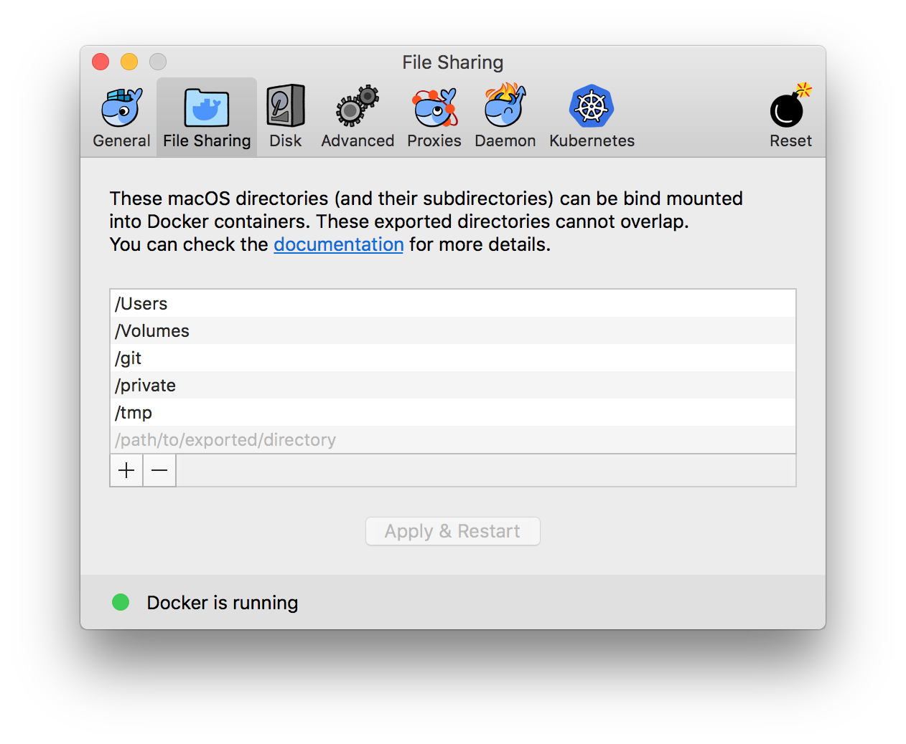
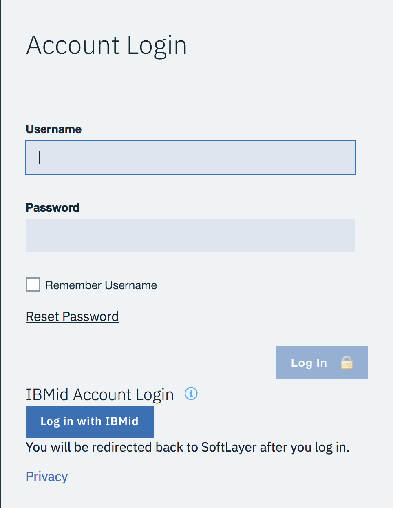
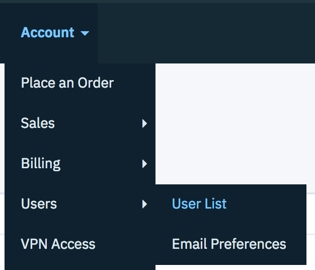
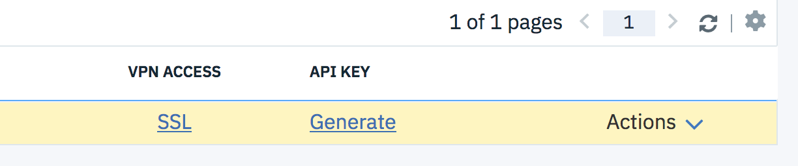
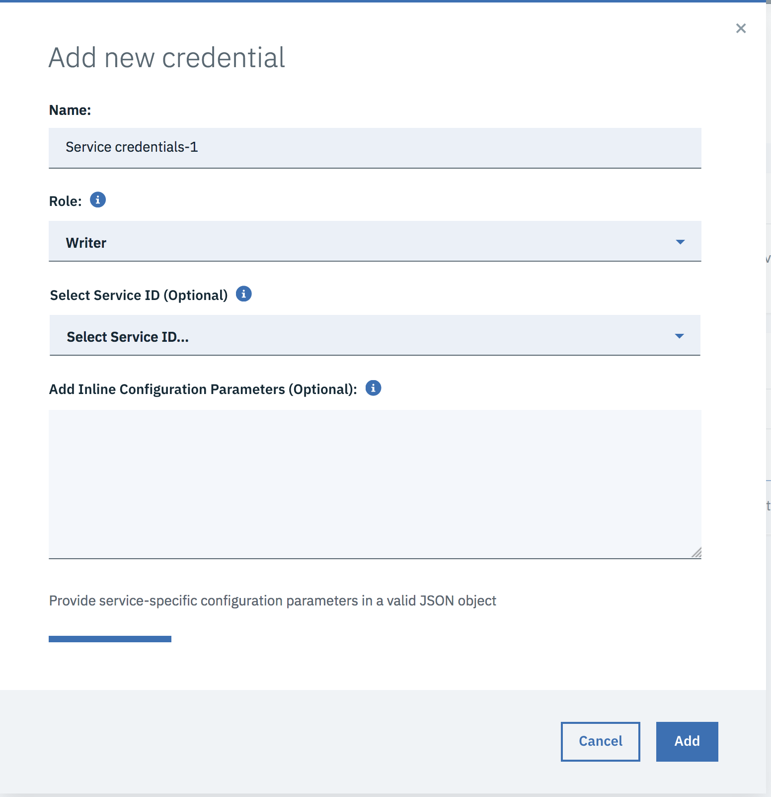

# Serverless REST API with IBM Cloud Functions (powered by Apache OpenWhisk)

[](https://travis.ibm.com/Andrea-Frittoli/ibm-cloud-functions-rest-api)

This reference architecture shows how serverless, event-driven architectures can execute code that scales automatically in response to demand from a RESP API. No code runs until an API call to and endpoint associated to a function is received by the API GW. When that happens, application instances are started to match the load needed by each API request exactly.

In addition to using cloud resources efficiently, this means that developers can build and deploy applications more quickly. You can learn more about the benefits of building a serverless architecture for this use case in the accompanying [IBM Code Pattern](https://developer.ibm.com/code/technologies/serverless/).

This repository provides a template skeleton for IBM Cloud Functions reference architectures. You can deploy it right away using the [provided deploy script on your own system](#deploy-through-the-deployment-script). Alternatively you can provision
the required components via the [IBM Cloud user interface](https://console.bluemix.net/)
and the cloud functions and APIs [using wskdeploy](#deploy-using-wskdeploy) or
step by step [using CLI commands on your own sytem](#deploy-step-by-step).

If you haven't already, sign up for an IBM Cloud account and go to the [Cloud Functions dashboard](https://console.bluemix.net/openwhisk/) to explore other [reference architecture templates](https://github.com/topics/ibm-cloud-functions-refarch) and download command line tools, if needed.

## Included components

* [IBM Cloud Functions](https://console.ng.bluemix.net/openwhisk) (powered by Apache OpenWhisk): Execute code on demand in a highly scalable, serverless environment.
* [IBM Cloud Functions APIs](https://console.bluemix.net/openwhisk/apimanagement) (powered by Apache OpenWhisk): Define APIs that wrap a set of OpenWhisk actions.
* [IBM Cloudant](https://console.ng.bluemix.net/catalog/services/cloudant-nosql-db): A fully managed data layer designed for modern web and mobile applications that leverages a flexible JSON schema (powered by CouchDB).
* [IBM AppID](https://console.bluemix.net/catalog/services/appid): Easily add authentication, secure back ends and APIs, and manage user-specific data for your mobile and web apps.

## TODO REST API with authentication

The application demonstrates using IBM Cloud Functions (based on Apache OpenWhisk) to build a REST API. The use case demonstrates how actions work with data services and execute logic in response to API requests. It also demonstrates how to secure the content
behind the API using IBM AppID, by requiring an authentication token to access the API.

The authentication is terminated by the API Gateway, so functions do not need to
worry about it. Functions receive the JWS token information from the API Gateway
and can use it to add content authorisation rules. In this pattern authenticated
users are connected to a dedicated Cloudant DB, so that the TODO list is personal
and persisted across sessions.

The REST API is a fully compliant implementation of the [TODO Backend API](https://www.todobackend.com/). It can be deployed with or without
authentication. When authentication is enabled, the API can be consumed via
the [client webapp](https://www.todobackend.com/client/index.html) and verified
with the [API tests](https://www.todobackend.com/specs/index.html).


## Featured technologies

* [Serverless](https://www.ibm.com/cloud-computing/bluemix/openwhisk): An event-action platform that allows you to execute code in response to an event.
* [Node.js](https://nodejs.org/): An open-source JavaScript run-time environment for executing server-side JavaScript code.

## Prerequisites

### Code and tools

You will need a few tools installed to deploy the patter yourself.
If you don't want to install them on your local machine and you have docker installed you can use the [IBM cloud tools docker image by JJ Asghar](https://jjasghar.github.io/ibm-docker/) that comes with everything you need preinstalled. Make sure to mount a folder from your local machine where you will clone the code and store your credentials. If using MacOS, you need to make sure that your folder is shared:




```
docker run -it -v $PWD:/root/serverless -it jjasghar/ibm-cloud-tools

IBM☁️  #
```

Alternatively, you can install the required tools on your system. The minimum tools you will need are `git` and `ibmcloud` ([installation instructions](https://console.bluemix.net/docs/cli/reference/ibmcloud/download_cli.html#install_use)).
Extra tools that are required for specific tasks:
* [jq](https://stedolan.github.io/jq/download/): required for the post install demo
* [wskdeploy](https://github.com/apache/incubator-openwhisk-wskdeploy#downloading-released-binaries): required when installing [using wskdeploy](#deploy-using-wskdeploy)
* [terraform](https://www.terraform.io/downloads.html) and [terraform IBM cloud](https://github.com/IBM-Cloud/terraform-provider-ibm/releases): required when installing using the [provided deploy script](#deploy-through-the-deployment-script)

You can download the code using git:

```
git clone https://github.ibm.com/Andrea-Frittoli/ibm-cloud-functions-rest-api
cd ibm-cloud-functions-rest-api
```

### Account and credentials
You will need an IBM Cloud account to use this pattern. If you don't have one,
[sign up for an IBM Cloud account](https://console.bluemix.net/registration/).

IBM Cloud Functions require an `org` and a `space` to be defined for your account. If you don't have them defined already you can follow the [instructions](https://console.bluemix.net/docs/account/orgs_spaces.html#orgsspacesusers) to create them. Alternatively you can use the `ibmcloud` CLI:

```
ibmcloud account org-create ORG_NAME
ibmcloud account space-create SPACE_NAME -o ORG_NAME
```

IBM Cloud Functions is available in different regions around the world. Select one region geographically close to you, and mark the `Name` from the table below.

```
Name       Display name    Customer   Deployment   Type
us-south   Dallas          IBM        Production   public
eu-de      Frankfurt       IBM        Production   public
eu-gb      London          IBM        Production   public
us-east    Washington DC   IBM        Production   public
```

You will need an API key. You can create one via the [IBM Cloud user interface](https://console.bluemix.net/iam/#/apikeys) or via the `ibmcloud` CLI:

```
ibmcloud iam api-key-create serverless_api \
  -d "For Serverless API Pattern" \
  --file serverless_api.apikey
```

The key will be stored in `serverless_api.apikey`:

```
cat serverless_api.apikey
{
	"name": "serverless_api",
	"description": "For Serverless API Pattern",
	"apikey": "xxxx_myawsomeapikey_yyyy",
	"createdAt": "1970-01-01T01:01+0000",
	"locked": false,
	"uuid": "ApiKey-111111-aaaa-3333-bbbb-5555555555"
}
```

You are now ready to setup your `local.env` file. Make a copy of the `template.local.env` which is in the root directory of the git repo you cloned.
Edit `local.env` and set `IBMCLOUD_API_KEY`, `IBMCLOUD_ORG`, `IBMCLOUD_SPACE` and `BLUEMIX_REGION` to match the apikey in `serverless_api.apikey` and the org, space and region name that you're using.

```
# Prepare a local.env
cd ibm-cloud-functions-rest-api
cp template.local.env local.env

# In your favourite editor, set:
IBMCLOUD_API_KEY=xxxx_myawsomeapikey_yyyy
IBMCLOUD_ORG=ORG_NAME
IBMCLOUD_SPACE=ORG_SPACE
BLUEMIX_REGION=REGION
```

### To Auth or not to Auth

If you want to enable protecting the REST API with authentication (powered by IBM AppID) edit your `local.env` and set:

```
API_USE_APPID=true
```

### Additional infrastructure

This pattern requires an instance of the [IBM Cloudant](https://console.ng.bluemix.net/catalog/services/cloudant-nosql-db) service and (optionally) of the [IBM AppID](https://console.bluemix.net/catalog/services/appid) service.
Both services are available in the [IBM Cloud catalog](https://console.bluemix.net/catalog/) and can be accessed using the IBM Cloud account previously created.

Both services offer a free service plan, named "lite", which is perfect for deploying and learning about this code pattern.

Only one instance per account of IBM Cloudant and IBM AppID may use the "lite" service plan. If you need to use the payed-for service plan, you can do so by
appending the following settings to your `local.env`.

*WARNING! You may incur charges when using the payed-for service plan*.

```
TF_VAR_appid_plan="Graduated tier"
TF_VAR_cloudant_plan=Standard
```

#### Infrastructure setup via Terraform

When deploying using the [provided deploy script](#deploy-through-the-deployment-script) it is possible to let Terraform provision and manage Cloudant and AppID for you. To do this you'll need Soft Layer credentials which are required by the [Terraform IBM Cloud Provider](https://ibm-cloud.github.io/tf-ibm-docs/).

Browse to the [SoftLayer control panel](https://control.softlayer.com/), and click on "Log in with IBMid":




Select "Account", "Users", "User List" from the menu:




Click on the "generate" link under "API KEY":




And finally click on the "view" link under "API KEY". It will prompt a text formatted as follows:

```
API Key for <softlayer username>

<softlayer api key>
```

Add the following settings to your `local.env`:

```
PROVISION_INFRASTRUCTURE=true
SL_USERNAME=<softlayer username>
SL_API_KEY=<softlayer api key>
```

#### Infrastructure setup via IBM Cloud Console

When deploying using the [provided deploy script](#deploy-through-the-deployment-script), as well as with any other deployment method, IBM Cloudand and IBM AppID services can be pre-provisioned using the [IBM Cloud Console](https://console.bluemix.net/).

Provision one instance of the [IBM Cloudant](https://console.ng.bluemix.net/catalog/services/cloudant-nosql-db) service and create service credentials for it, as described in this [guide](https://console.bluemix.net/docs/services/Cloudant/tutorials/create_service.html#creating-an-ibm-cloudant-instance-on-ibm-cloud).

If authentication is enabled, provision one instance of the [IBM AppID](https://console.bluemix.net/catalog/services/appid) service.
Once provisioned, select "Service Credentials" on the left, and create new credentials, using the "Writer" role:




Add the following settings to your `local.env`, extracted from the service credentials of Cloudant and AppID:

```
# Cloudant Service Credentials
CLOUDANT_USERNAME=value
CLOUDANT_PASSWORD=value

# AppID Service Credentials
API_APPID_TENANTID=value
```

## Deploy through the deployment script

This approach deploys the entire code pattern with one script.
The script invokes `wskdeploy` to deploy IBM Cloud Functions and APIs, and, if requested, it uses `terraform` to provision any required extra infrastructure.

### Deployment

To use the deployment script change directory to the root of the cloned git repo:

```bash
# Run the installer
./deploy.sh --install
```

The deployment script outputs the highlights of the deployment process on the console. More details are available in the `deploy.log` log file. A correct output will look like:

```
Full install output in /git/github.ibm.com/Andrea-Frittoli/ibm-cloud-functions-rest-api/deploy.log
Logging in to IBM cloud
Provisioning Terraform managed infrastructure
Provisioning Functions and APIs
All done

ok: APIs
Action                              Verb  API Name  URL
/ORG_NAME_ORG_SPACE/todo_package/get_todo    get      todos  https://<base_endpoint>/gws/apigateway/api/<id>/v1/todo
/ORG_NAME_ORG_SPACE/todo_package/post_todo   post     todos  https://<base_endpoint>/gws/apigateway/api/<id>/v1/todo
/ORG_NAME_ORG_SPACE/todo_package/delete_todo delete   todos  https://<base_endpoint>/gws/apigateway/api/<id>/v1/todo
/ORG_NAME_ORG_SPACE/todo_package/patch_todo  patch    todos  https://<base_endpoint>/gws/apigateway/api/<id>/v1/todo
```

### Verification

Once the service is deployed, it can be verified using the deploy script in demo mode:

```bash
# Run the installer
./deploy.sh --demo
```

A successful output will look like:

```
Logging in to IBM cloud
Provision a user in the cloud directory
Get a token from the demo user
Post a TODO
{
  "title": "Run the demo",
  "completed": false,
  "url": "https://<endpoint>/gws/apigateway/api/<id>/v1/todo/0e6a11c0223ca15940f37795deefc829"
}
Post a TODO
{
  "title": "Like this pattern",
  "completed": false,
  "url": "https://<endpoint>/gws/apigateway/api/<id>/v1/todo/ff3e0a79b8d2f1ad4d1e95e7f318ccce"
}
List all TODOs
[
  {
    "title": "Run the demo",
    "completed": false,
    "url": "https://<endpoint>/gws/apigateway/api/<id>/v1/todo//0e6a11c0223ca15940f37795deefc829"
  },
  {
    "title": "Like this pattern",
    "completed": false,
    "url": "https://<endpoint>/gws/apigateway/api/<id>/v1/todo//ff3e0a79b8d2f1ad4d1e95e7f318ccce"
  }
]
Delete all TODOs
{}
```

### Undeployment

```bash
./deploy.sh --uninstall
```

## Deploy Using `wskdeploy`

This approach deploys functions and APIs to the IBM Cloud Functions service using `wskdeploy`. Before you can do this, follow the steps in [Infrastructure setup via IBM Cloud Console](#infrastructure-setup-via-ibm-cloud-console).

The script invokes `wskdeploy` to deploy IBM Cloud Functions and APIs, and, if requested, it uses `terraform` to provision any required extra infrastructure.

### Deployment

To use this deployment approach change directory to the root of the cloned git repo and run wskdeploy.

```bash
# Run wskdeploy
. local.env
wskdeploy -p ./runtimes/nodejs
```
The output will look something like:

```
Info: The API host is [openwhisk.ng.bluemix.net], from .wskprops.
Info: The auth key is set, from .wskprops.
Info: The namespace is [_], from .wskprops.
Info: The apigw access token is set, from .wskprops.
Info: Unmarshal OpenWhisk runtimes from internet at https://openwhisk.ng.bluemix.net.
Info: Deploying package [todo_package] ...
Info: package [todo_package] has been successfully deployed.

Info: Deploying action [todo_package/get_todo] ...
Info: action [todo_package/get_todo] has been successfully deployed.

Info: Deploying action [todo_package/delete_todo] ...
Info: action [todo_package/delete_todo] has been successfully deployed.

Info: Deploying action [todo_package/post_todo] ...
Info: action [todo_package/post_todo] has been successfully deployed.

Info: Deploying action [todo_package/patch_todo] ...
Info: action [todo_package/patch_todo] has been successfully deployed.

Info: Deploying api [todos /v1/todo PATCH] ...
Info: api [todos /v1/todo PATCH] has been successfully deployed.

Info: Deploying api [todos /v1/todo GET] ...
Info: api [todos /v1/todo GET] has been successfully deployed.

Info: Deploying api [todos /v1/todo DELETE] ...
Info: api [todos /v1/todo DELETE] has been successfully deployed.

Info: Deploying api [todos /v1/todo POST] ...
Info: api [todos /v1/todo POST] has been successfully deployed.
```

When using IBM AppID, the tenant_id from the AppID service credentials must be configured in the API definition. To do that run the following commands from the root of the folder where you cloned the git repo:

```bash
. local.env
ibmcloud fn api get todos --format json | \
    python ./appid/api_def_add_auth.py $API_APPID_TENANTID \
    > ./appid/_api_definition.json
 ibmcloud fn api create -c ./appid/_api_definition.json
```

The output will look like:

```
ok: created API /v1/todo get for action /ORG_NAME_ORG_SPACE/todo_package/get_todo
https://<endpoint>/gws/apigateway/api/<id>/v1/todo
ok: created API /v1/todo post for action /ORG_NAME_ORG_SPACE/todo_package/post_todo
https://<endpoint>/gws/apigateway/api/<id>/v1/todo
ok: created API /v1/todo delete for action /ORG_NAME_ORG_SPACE/todo_package/delete_todo
https://<endpoint>/gws/apigateway/api/<id>/v1/todo
ok: created API /v1/todo patch for action /ORG_NAME_ORG_SPACE/todo_package/patch_todo
https://<endpoint>/gws/apigateway/api/<id>/v1/todo
```

### Undeployment

To use this undeployment approach change directory to the root of the cloned git repo and run wskdeploy.

```bash
# Run wskdeploy
. local.env
wskdeploy undeploy -p ./runtimes/nodejs
```

## Deploy Step by Step

To use this deployment approach change directory to the root of the cloned git repo and create all functions and API, one by one, by using `ibmcloud fn`.

### Deployment

Setup the environment:

```bash
. local.env
cd runtimes/nodejs/actions
```

Create the package:

```bash
ibmcloud fn package create todo_package \
    --param username $CLOUDANT_USERNAME \
    --param password $CLOUDANT_PASSWORD \
    --param base_path /v1/todo
```

Which results in:
```
ok: created package todo_package
```

Create the get action:

```bash
TODO_ACTION=get
pushd $TODO_ACTION
zip ../${TODO_ACTION}.zip *
popd
zip ${TODO_ACTION}.zip common/utils.js
ibmcloud fn action create todo_package/${TODO_ACTION}_todo \
  --kind nodejs:8 \
  --web true \
  ${TODO_ACTION}.zip
```

Which results in:
```
ok: created action todo_package/get_todo
```

Repeat the step above three more times the other action by setting TODO_ACTION to different values:

```bash
TODO_ACTION=post
TODO_ACTION=patch
TODO_ACTION=delete
```

Once all actions have been created you may verify your work by:

```bash
ibmcloud fn action list todo_package
```

Which should return:
```
actions
/ORG_NAME_ORG_SPACE/todo_package/get_todo           private nodejs:8
/ORG_NAME_ORG_SPACE/todo_package/patch_todo         private nodejs:8
/ORG_NAME_ORG_SPACE/todo_package/post_todo          private nodejs:8
/ORG_NAME_ORG_SPACE/todo_package/delete_todo        private nodejs:8
```

Create the API for the GET method:

```bash
TODO_ACTION=get
ibmcloud fn api create /v1 /todo $TODO_ACTION \
  /ORG_NAME_ORG_SPACE/todo_package/${TODO_ACTION}_todo \
  --response-type http \
  -n todos
```

Which results in:
```
ok: created API /v1/todo GET for action /ORG_NAME_ORG_SPACE/todo_package/get_todo
https://<endpoint>/gws/apigateway/api/<id>/v1/todo
```

Repeat the step above three more times the other APIs by setting TODO_ACTION to different values:

```bash
TODO_ACTION=post
TODO_ACTION=patch
TODO_ACTION=delete
```

When using IBM AppID, the tenant_id from the AppID service credentials must be configured in the API definition. To do that run the following commands from the root of the folder where you cloned the git repo:

```bash
. local.env
ibmcloud fn api get todos --format json | \
    python ./appid/api_def_add_auth.py $API_APPID_TENANTID \
    > ./appid/_api_definition.json
 ibmcloud fn api create -c ./appid/_api_definition.json
```

The output will look like:

```
ok: created API /v1/todo get for action /ORG_NAME_ORG_SPACE/todo_package/get_todo
https://<endpoint>/gws/apigateway/api/<id>/v1/todo
ok: created API /v1/todo post for action /ORG_NAME_ORG_SPACE/todo_package/post_todo
https://<endpoint>/gws/apigateway/api/<id>/v1/todo
ok: created API /v1/todo delete for action /ORG_NAME_ORG_SPACE/todo_package/delete_todo
https://<endpoint>/gws/apigateway/api/<id>/v1/todo
ok: created API /v1/todo patch for action /ORG_NAME_ORG_SPACE/todo_package/patch_todo
https://<endpoint>/gws/apigateway/api/<id>/v1/todo
```

### Undeployment

To use this deployment approach delete all functions and API:

```bash
ibmcloud fn api delete todos
ibmcloud fn action delete /ORG_NAME_ORG_SPACE/todo_package/get_todo
ibmcloud fn action delete /ORG_NAME_ORG_SPACE/todo_package/post_todo
ibmcloud fn action delete /ORG_NAME_ORG_SPACE/todo_package/patch_todo
ibmcloud fn action delete /ORG_NAME_ORG_SPACE/todo_package/delete_todo
```

## License

[Apache 2.0](LICENSE)
